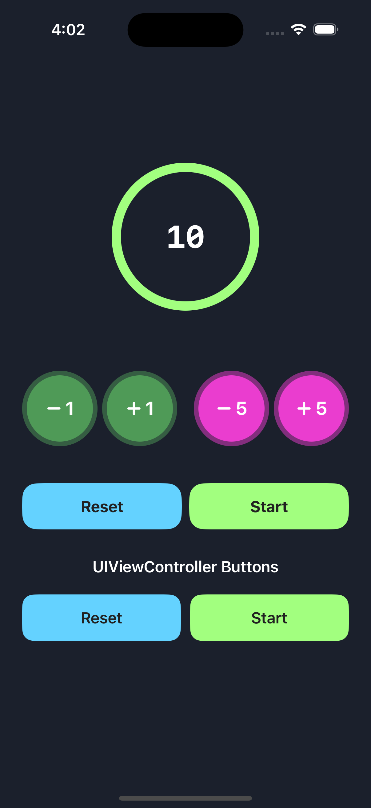

A SwiftUI countdown timer hosted in a UIViewController. The timer is controlled by a CountdownTimerManager, which uses a timer publisher. This project aims to understand timer publishers and control a SwiftUI view from a UIViewController.

 
